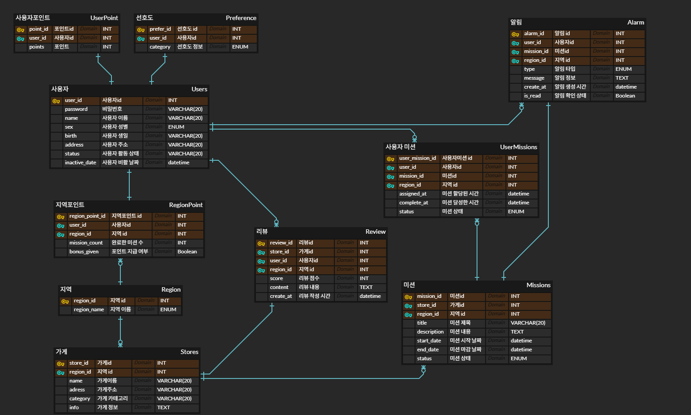

# WEEK 0 - 하지명

## 미션 

### 미션 내용
1. 주어진 IA와 와이어 프레임을 보고 직접 데이터베이스를 설계하기
2. 이름 글자 수 등 세부적인 부분은 원하는 대로 해도 됨
3. 각 지역 별로 가게들이 있으며, 가게를 방문하는 미션을 해결하며 포인트를 모으는 서비스
   * 모든 지역마다 10개의 미션 클리어시 1000 point 부여로 고정

    
### 미션 수행

