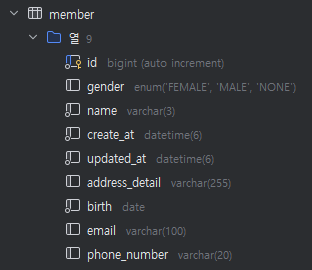
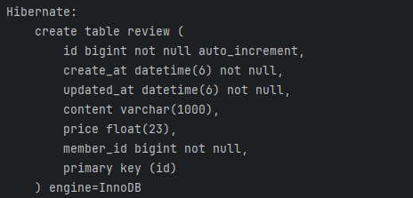
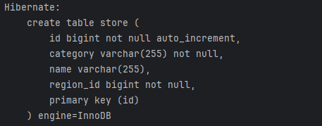
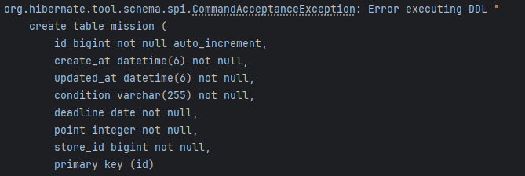
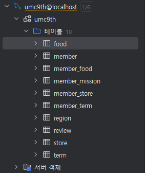
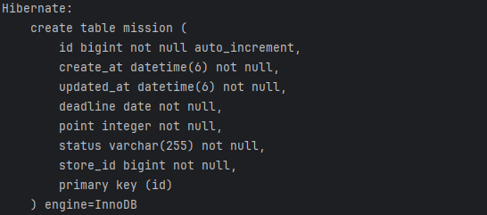
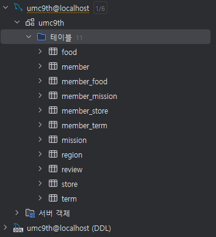

# WEEK 4 하지명

## 미션 레포지토리
[**깃허브**](https://github.com/hajimeong/UMC_Study_Project)

## 미션 레포 커밋 설명
1. 프로젝트 생성 및 초기 설정
2. UMC Study Week 4 실습 코드
   - 4주차 워크북 실습 파트 수행
3. UMC Study Week 4 mission
   - 4주차 미션 수행 

## 미션 수행 결과
### 1. member 테이블 생성 결과
4주차 워크북 실습을 수행하면서 member table 생성 결과 화면 캡처하지 못함  
생성되어있는 member table 결과 사진으로 대체  

### 2. review 테이블 생성 결과

### 3. store 테이블 생성 결과

### 4. mission 테이블 생성 결과
#### [실패]
mission 테이블의 column이름 설정의 문제로 mission 테이블이 생성되지 않았음  

- mission 상태를 의미하는 condition이 기존 mysql 명령어임을 생각하지 못한 채로 column이름을 설정해서 발생한 문제

- mission의 오류를 파악하지 못한 채 실행한 결과 = mission 테이블이 생성되지 않았음을 확인할 수 있음

#### [성공]
mission 테이블의 condition을 status로 변환한 뒤 수행  
  

- mission 테이블이 제대로 생성되었음을 확인할 수 있음
