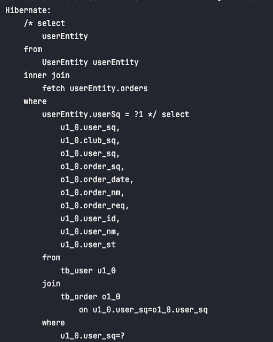

# Week 6 -하지명

### 핵심 키워드
```text
1. QueryDSL에서 FetchJoin하는 방법
2. DTO 매핑 방식(+DTO안에 DTO)
3. 커스텀 페이지네이션
4. transform-groupBy
5. order by null
```

## 1. QueryDSL에서 FetchJoin하는 법
### QueryDSL
- 다양한 데이터베이스 플랫폼에 접근하여 SQL과 유사한 문법으로 쿼리를 작성하여 데이터 처리를 수행하는 데 도움을 주는 프레임워크
- 타입-세이프(type-safe)하게 쿼리를 작성하도록 지원하면 SQL 형태가 아닌 '자바 코드'로 작성하여 데이터베이스 쿼리 작성을 쉽고 안전하게 만들어줌

### QueryDSL Join 메서드: com.querydsl.jpa.JPAQueryBase 패키지
- QueryDSL 라이브러리의 일부로 JPA 쿼리를 구성하고 실행하는 데 사용되는 클래스
- 다양한 종류의 쿼리 메서드를 제공하여, join, inner join, left join, right join, fetch join 등의 쿼리를 구성할 수 있음
#### fetcJoin() 메서드
- 마지막으로 정의된 조인에 `fetchJoin`플래그를 추가
- 컬레션 조인은 중복 행르 결과로 가져올 수 있으며, "inner join fetchJoin"은 결과 세트를 제한함

### FETCH JOIN
- JPA에서만 존재하는 조인 방식으로 연관된 엔티티(Entity) 또는 컬렉션(Collection)을 SQL 내에서 한 번에 조회하는 기능을 제공함
- 테이블 간의 관계에서 1:1, 1:다, 다:다 관계에서 모두 사용이 가능하며 Fetch Type이 지연로딩(Lazy) 형태로 설정되어 있는 경우라도, 한 번에 데이터를 조회해오는 방식을 의미

### 패치 조인 관계 예시
- 사용자 테이블(tb_user)을 기준으로 주문 테이블(th_order)은 1:다 관계</br> 사용자가 한 명이 있으면 주문 정본느 여러 개
- 해당 관계에서 사용자 테이블(tb_user)의 엔티티는 주문 테이블(tb_user)의 엔티티와 @OneToMany 관계를 형성
#### 사용자 엔티티 구조
```java
@Entity
@Getter
@Table(name = "tb_user")
@NoArgsConstructor(access = AccessLevel.PROTECTED)
public class UserEntity implements Serializable {
    @Id
    @GeneratedValue(strategy = GenerationType.IDENTITY)
    @Comment("사용자 시퀀스")
    @Column(name = "user_sq")
    private long userSq;

    @Comment("사용자 아이디")
    @Column(name = "user_id")
    private String userId;

    @Comment("사용자 이름")
    @Column(name = "user_nm")
    private String userNm;

    @Comment("사용자 상태")
    @Column(name = "user_st")
    private String userSt;

    @Comment("동아리 시퀀스")
    @Column(name = "club_sq")
    private long clubSq;

    @OneToMany(fetch = FetchType.LAZY, mappedBy = "userInfo")
    private List<OrderEntity> orders;

}
```

#### 주문 엔티티의 구조
```java
@Entity
@Table(name = "tb_order")
@NoArgsConstructor(access = AccessLevel.PROTECTED)
public class OrderEntity {
    @Id
    @GeneratedValue(strategy = GenerationType.IDENTITY)
    @Column(name = "order_sq")
    @Comment("주문 시퀀스")
    private long orderSq;

    @Column(name = "user_sq", insertable = false, updatable = false)
    @Comment("사용자 시퀀스")
    private Long userSq;

    @Column(name = "order_nm")
    @Comment("주문명")
    private String orderNm;

    @Column(name = "order_req")
    @Comment("주문 요청 정보")
    private String orderReq;

    @Column(name = "order_date")
    @Comment("주문일자")
    @CreationTimestamp
    private Timestamp orderDate;

    @ManyToOne(fetch = FetchType.LAZY)
    @JoinColumn(name = "user_sq")
    private UserEntity userInfo;
}
```
#### 패치 조인 적용 이전
- 파라미터로 전달받은 userSq 값에 따라 일반적인 select문을 수행
- 해당 결과로 userEntity의 모든 값을 가져옴
```java
public List<UserEntity> selectUserInfo(UserDto userDto) {
    return queryFactory
            .selectFrom(qUser)
            .where(qUser.userSq.eq(userDto.getUserSq()))
            .fetch();
}
```


#### 패치 조인 적용 후
- join이 수행되는 부분 뒤에 fetchJoin()을 추가
- 결과로 orderEntity의 값을 모두 가져옴
```java
 public List<UserEntity> selectUserInfo(UserDto userDto) {
    return queryFactory
            .selectFrom(qUser)
            .join(qUser.orders)
            .fetchJoin()
            .where(qUser.userSq.eq(userDto.getUserSq()))
            .fetch();
}
```



## 2. DTO 매핑 방식(+DTO 안에 DTO)
엔티티 그대로 반환하면 API 응답 구조 제어가 어려워 DTO로 변환
### (1) Projections.bean() - Setter 기반
```java
List<MemberDto> result = queryFactory
    .select(Projections.bean(MemberDto.class,
        member.username.as("username"),
        member.age.as("age")
    ))
    .from(member)
    .fetch();
```
- MemberDto의 setter가 반드시 있어야 함
- 프로퍼티 이름 또는 `as("alias)`로 필드 매핑
- 스프링 빈처럼 필드 이름 매칭됨
  ```java
    @Data
    public class MemberDto {
    private String username;
    private int age;
    }
    ```
  
### (2) Projections.fields() - 필드 직접 접근
```java
List<MemberDto> result = queryFactory
    .select(Projections.fields(MemberDto.class,
        member.username.as("username"),
        member.age
    ))
    .from(member)
    .fetch();
```
- 필드에 직접 접근해서 setter 없어도 됨
- 별칭(alias) 정확히 맞춰줘야 함
- `as("username")`처럼 DTO 필드 이름과 다를 경우 필수

### (3) Projections.constructor() - 생성자 기반
```java
List<MemberDto> result = queryFactory
    .select(Projections.constructor(MemberDto.class,
        member.username,
        member.age
    ))
    .from(member)
    .fetch();
```
- 생성자 파라미터 순서와 타입이 정확히 일치해야 함
- 컴파일 타임 타입 체크는 불가능하므로 런타임 에러 주의
```java
@AllArgsConstructor
public class MemberDto {
    private String username;
    private int age;
}
```

### + DTO 안에 DTO (중첩 DTO 매핑)
중첩된 DTO 구조 예시
```java
@Getter
@AllArgsConstructor
public class MemberResponseDto {
    private String username;
    private int age;
    private TeamDto team;

    @Getter
    @AllArgsConstructor
    public static class TeamDto {
        private String teamName;
    }
}
```
#### (1) 단순 중첩 DTO 매핑 - Projections.constructor() 활용
```java
List<MemberResponseDto> result = queryFactory
    .select(Projections.constructor(MemberResponseDto.class,
        member.username,
        member.age,
        Projections.constructor(MemberResponseDto.TeamDto.class,
            team.name
        )
    ))
    .from(member)
    .join(member.team, team)
    .fetch();
```
- 생성자 기반으로 중첩 DTO를 직접 생성할 수 있음
- 각 DTO가 생성자를 통한 초기화 가능해야 함
- 정적 내부 클래스(static inner class)로 정의해두면 관리가 편함
#### (2) 필드 기반 중첩 DTO 매핑 - Projections.fields()+ ExpressionUtils
필드를 직접 매핑하는 방식을 사용하고 싶으면, `ExpressionsUtils.as()`로 별칭을 지정해야 함
```java
List<MemberResponseDto> result = queryFactory
    .select(Projections.fields(MemberResponseDto.class,
        member.username,
        member.age,
        Projections.fields(MemberResponseDto.TeamDto.class,
            team.name.as("teamName")
        ).as("team")
    ))
    .from(member)
    .join(member.team, team)
    .fetch();
```
- `Projections.fields()`는 내부적으로 필드 이름 기반으로 주입하기 때문에 중첩 필드의 이름(`team`)과 DTO 내부 필드 이름이 정확히 일치해야 함
- `MemberResponseDto`안의 필드명이 `private TeamDto team;` 이어야 함

#### (3) Q-Type 기반 매핑(추천, 최신 방식)
QueryDSL 5.x 이후에는 `@QueryProjection`을 이용한 Q DTO 생성 방식도 선호됨
```java
@Getter
public class MemberResponseDto {
    private final String username;
    private final int age;
    private final TeamDto team;

    @QueryProjection
    public MemberResponseDto(String username, int age, TeamDto team) {
        this.username = username;
        this.age = age;
        this.team = team;
    }

    @Getter
    public static class TeamDto {
        private final String teamName;

        @QueryProjection
        public TeamDto(String teamName) {
            this.teamName = teamName;
        }
    }
}
```
이후 컴파일 시 Q 클래스(QMemberResponseDto, QTeamDto)가 생성되며,
타입 안정성을 보장하면서 매핑할 수 있음
```java
List<MemberResponseDto> result = queryFactory
    .select(new QMemberResponseDto(
        member.username,
        member.age,
        new QMemberResponseDto_TeamDto(team.name)
    ))
    .from(member)
    .join(member.team, team)
    .fetch();
```
- 장점
  - 컴파일 타임 타입 체크 가능
  - 중첩 DTO도 Q 클래스로 안전하게 생성 가능
- 단점
  - 하지만, DTO 코드에 QueryDSL 의존성이 생김

## 3. 커스텀 페이지네이션
Spring Data JPA나 QueryDSL이 기본으로 제공하는 페이지네이션(Pageable, Page)기능을 그대로 쓰지 않고,
직접 쿼리와 로직을 구성해서 페이징을 제어하는 방식

### 기본 페이지네이션
```java
Page<Member> page = memberRepository.findAll(PageRequest.of(0, 10));
```
- 자동으로 `count(*)`쿼리를 함께 실행해서 전체 개수 계산
- 내부적으로 limit, offset이 자동 적용됨
- 반환 타입은 `Page<T>`로 고정(content, totalElements, totalPages 등 포함)

#### 커스텀 페이지네이션이 필요한 이유
| 상황                      | 이유                                              |
|:------------------------|:------------------------------------------------|
| 복잡한 쿼리(Join/Subquery 등) | Spring Data의 자동 카운트 쿼리가 비효율적이거나 불가능             |
| 성능 최적화 필요               | `count()` 쿼리를 따로 분리해서 최적화하거나 생략                 |
| DTO조회(QueryDSL 사용)      | `Page<T>` 대신 DTO 결과에 맞춘 페이지 객체를 직접 구성           |
| 무한 스크롤(Infinite Scroll) | `Pageable` 대신 `cursor` 방식(offset 대신 last id 사용) |

#### 1. QueryDSL 기반 커스텀 페이지네이션
- `PageImpl`을 통해 커스텀 쿼리 결과를 Page 형태로 직접 래핑
- 카운트 쿼리를 직접 제어 가능
- 복잡한 조건에도 대응 가능

#### 2. count() 생략형 커스텀 페이지네이션(성능 최적화)
- 커스텀 Slice 기반 페이지네이션
- API에서 무한 스크롤을 구현할 때 자주 사용

#### 3. 커서 기반 페이지네이션(Cursor Pagination)
- offset 대신 정렬 기준 컬럼 (id 등)을 커서로 사용
- 큰 데이터셋에서도 성능이 훨씬 좋음
- SNS, 쇼핑몰, 피드형 UI 등에서 자주 사용

| 구분               | 설명                                   | 반환 타입      | 장점               | 단점              |
| ---------------- | ------------------------------------ | ---------- | ---------------- | --------------- |
| **기본 페이지네이션**    | Spring Data의 자동 count + limit/offset | `Page<T>`  | 간단, 자동           | count 쿼리 비효율 가능 |
| **커스텀 PageImpl** | count 쿼리 직접 구성                       | `Page<T>`  | 복잡한 쿼리 대응, 성능 개선 | 코드 많음           |
| **Slice 기반**     | count 생략, 다음 페이지 여부만 판단              | `Slice<T>` | 빠름, 무한 스크롤용      | 전체 개수 불가        |
| **커서 기반**        | ID 기준으로 페이징                          | `List<T>`  | 대용량 데이터 적합       | 구현 복잡           |

## 4. transform-groupBy
QueryDSL에서 여러 데이터를 그룹화하고 변환해서 DTO 형태로 매핑할 때 사용하는 고급 기능</br>
1:N 관계 같은 데이터를 한 번의 쿼리로 묶어서 조회할 때 매우 유용

```java
queryFactory
    .from(member)
    .join(member.team, team)
    .transform(
        groupBy(team.id)
            .as(Projections.constructor(TeamDto.class,
                team.name,
                list(Projections.constructor(MemberDto.class,
                    member.username,
                    member.age
                ))
            ))
    );
```
- groupBy(team.id) -> 팀별로 그룹화
- .as(...) -> 그룹화된 데이터를 DTO로 변환(transform)
- list(...) -> N쪽 데이터를 리스트 형태로 묶기
#### 내부 동작 요약
| 역할                | 설명                                     |
| ----------------- | -------------------------------------- |
| `groupBy(expr)`   | SQL의 GROUP BY 역할, Key 기준으로 데이터 묶기      |
| `.as(...)`        | 그룹화된 데이터를 특정 형태로 변환                    |
| `list()`          | N쪽 데이터를 리스트로 수집                        |
| `set()` / `map()` | 중복 없는 집합(set)이나 key-value(map) 형태로도 가능 |
| `transform()`     | 최종 변환 수행 (결과는 Map으로 반환됨)               |

### 정리
| 항목         | 설명                                                     |
| ---------- | ------------------------------------------------------ |
| **기능**     | QueryDSL에서 group by + DTO 변환을 한 번에 수행                  |
| **반환 형태**  | `Map<key, DTO>` (혹은 중첩 Map)                            |
| **주요 메서드** | `groupBy()`, `list()`, `set()`, `map()`, `transform()` |
| **사용 목적**  | 1:N, N:M 관계 데이터를 한 번에 DTO로 매핑                          |
| **장점**     | 쿼리 1번으로 중첩 구조 DTO 구성 가능                                |
| **단점**     | 코드가 다소 복잡, 메모리 부담                                      |

## 5. order by null
정렬하지 마라는 의미로,
DB가 데이터를 정렬하지 않고, 읽히는 순서 그대로 결과를 반환하라는 명령

### 사용하는 상황
`GROUP BY`, `UNION`, `DISTINCT` 같은 쿼리를 자동으로 정렬을 수행하는 경우가 있는데,
정렬이 필요 없을 때 </br>
-> 정렬하지 말고 그냥 묶기만하는 의미

### 사용 예시
```sql
SELECT team_id, COUNT(*)
FROM member
GROUP BY team_id
ORDER BY NULL;
```
팀별로 인원 수만 세고, 정렬은 하지 않겠다는 의미

### 효과
- 정렬 안해서 쿼리 속도 빨라짐
- 결과 순서는 보장 안됨