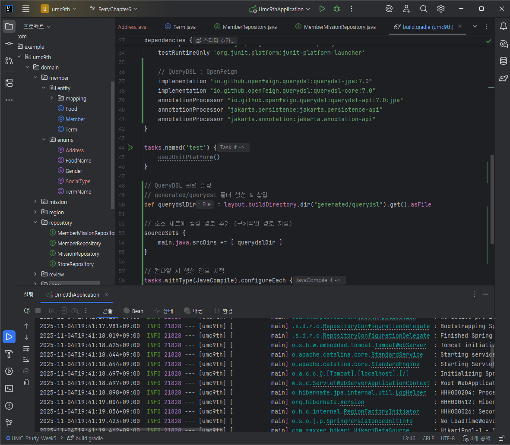
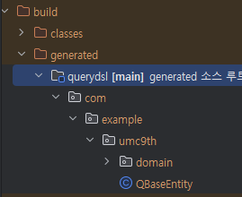

# Week 6 - 하지명

### Feat/Chapter6 브랜치 생성

## 1. QueryDSL 설치 인증

- build.gradle에 QueryDSL 설치 코드 추가
- gradle 동기화 후 실행한 결과 정상적으로 돌아가는 것을 확인할 수 있음

## 2. 미션
[미션 깃허브 링크](https://github.com/hajimeong/UMC_Study_Week5/tree/Feat/Chapter6)