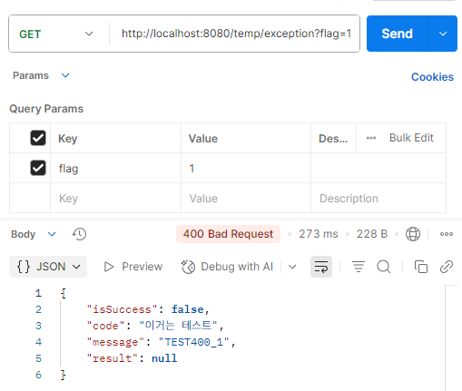
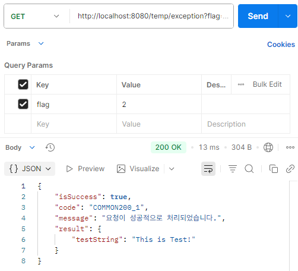

# Week 7 Mission

### 미션 수행 깃허브 링크
[깃허브](https://github.com/hajimeong/UMC_Study_Mission/tree/Feat/Chapter7)

### 응답통일 처리 하기 
- 응답 처리 후 테스트 실행 확인
    

#### 예외 처리 정상 작동 테스트
- exception flag 1일 때 오류 발생
    
- exception flag 2일 때 정상 작동
