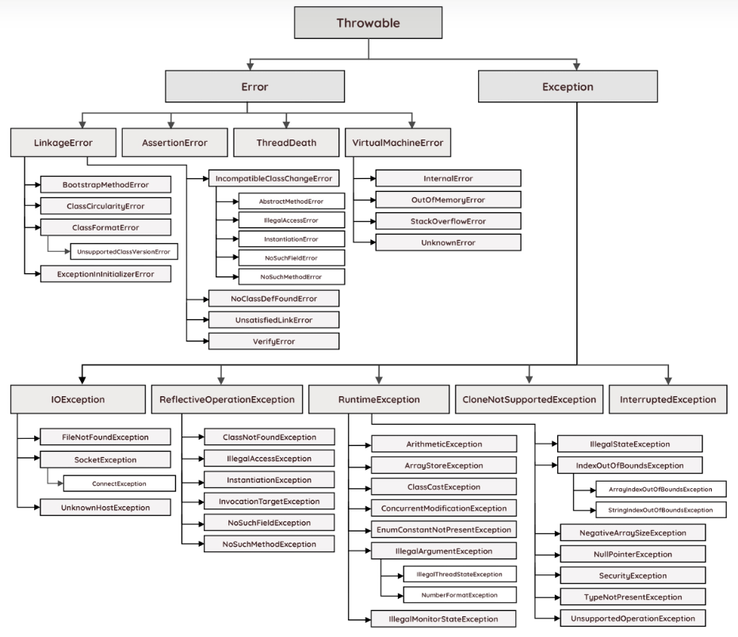
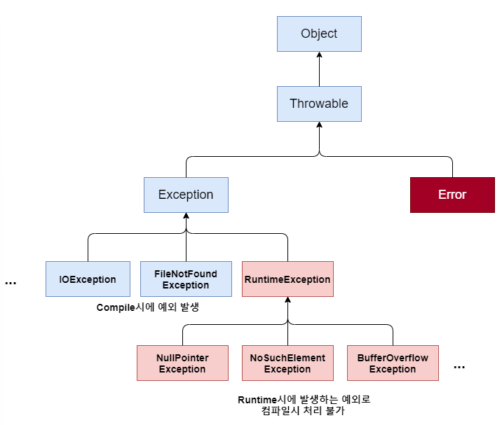

# Week 8 
### 핵심 키워드
- Java의 Exception 종류
- @Valid

## 1. Java의 Exception 종류
### 예외 클래스의 계층 구조
자바에서는 오류를 Error와 Exception으로 나누고, 이들을 클래스로 구현해 처리하도록 함</br>
IllegalArgumentException을 비롯해 NullPointerException과 IOException 모두 클래스로 구현되어 있음</br>
</br>
JVM은 프로그램을 실행하는 도중에 예외가 발생하면 해당 예외 클래스로 객체를 생성하고, 예외 처리 코드에서 예외 객체를 이용할 수 있도록 해줌</br>
`getMessage()`나 `printStackTrace()` 메서드 역시 예외 객체의 메서드를 가져와 오류를 출력하는 것</br>

#### 오류 클래스 계층 구조

Error 클래스는 외부적인 요인으로 인해 발생하는 오류라 개발자가 대처할 수 없음</br>
따라서 Exception 클래스가 중요함

#### [Throwable 클래스]
```md
오류와 예외 모두 자바의 최상위 클래스인 Object를 상속받음
그리고 그 사이에는 Throwable 클래스와 상속관계가 있는데, Throwable 클래스의 역할은 오류나 예외에 대한 메시지를 담는 것임
대표적으로 `getMessage()`, `printStackTrace()` 메서드가 Throwable 클래스가 속해있음
당연히 Throwable을 상속받은 Error와 Exception 클래스에서도 위 두 메서드를 사용할 수 있게 됨
```

자바에서 다루는 모든 예외 오류는 **Exception 클래스**에서 처리함</br>
그리고 아래의 Exception 클래스 트리 구조를 보면 파랑색과 붉은색으로 색깔별로 구분됨을 볼 수 있는데,
이것이 컴파일 에러와 런타임 에러를 따로 클래스로 구분했기때문임


Exception 클래스는 `RuntimeException(런타임 에러)`과 그 외의 `자식 클래스 그룹(컴파일 에러)`으로 나뉨
1. Exception 및 하위 클래스: 사용자의 실수와 같은 외적인 요인에 의해 발생하는 컴파일 시 발생하는 예외
    - 존재하지 않은 파일의 이름을 입력(FileNotFoundException)
    - 실수로 클래스의 이름을 잘못 기재(ClassNotFoundException)
    - 입력한 데이터 형식이 잘못된 경우(DataFormatException)
2. RuntimeException 클래스: 프로그래머의 실수로 발생하는 예외
    - 배열의 범위를 벗어남(IndexOutBoundsException)
    - 값이 null인 참조 변수의 멤버를 호출(NullPointerException)
    - 클래스 간의 형 변환을 잘못함(ClassCastException)
    - 정수를 0으로 나누는 산술 오류(ArithmeticException)

### 런타임 예외 클래스 종류
|             예외 타입             | 설명                              |
|:-----------------------------:|:--------------------------------|
|      ArithmeticException      | 어떤 수를 0으로 나누는 것과 같이 비정상 계산 중 발생 |
|     NullPointerException      | NULL 객체 참조 시 발생                 |
|   IllegalArgumentException    | 메소드의 전달 인자값이 잘못될 경우 발생          |
|     IllegalStateException     | 객체의 상태가 메소드 호출에는 부적합할 경우 발생     |
|   IndexOutOfBoundsException   | index 값이 범위를 넘어갈 경우 발생          |
| UnsupportedOperationException | 객체가 메소드를 지원하지 않은 경우 발생          |
|       SecurityException       | 보안 위반 발생 시 보안 관리 프로그램에서 발생      |
|       ProviderException       | 구성 공급자 오류 시 발생                  |
|    NoSuchElementException     | 구성 요소가 그 이상 없는 경우 발생            |
|      ArrayStoreException      | 객체 배열에 잘못된 객체 유형 저장 시 발생        |
|      ClassCastException       | 클래스 간의 형 변환 오류 시 발생             |
|      EmptyStackException      | 스택이 비어있는데 요소를 제거하려고 할 시 발생      |

### 컴파일 예외 클래스 종류
1. IOException
    - 컴퓨터 프로그램이 실행될 때 언제 어떤 문제가 발생할지 모르는 일이기 때문에, 컴퓨터와 상호소통 하는 I/O에 관해서는 발생할 수 있는 예외에 대해서 까다롭게 규정
    - 입출력을 다루는 메서드에 예외처리가 없다면 컴파일 에러가 발생하게 됨
2. FileNotFoundException
    - 파일에 접근하려고 하는데 파일을 찾지 못했을 때 발생하는 에러

## 2. @Valid
### 정의
- @Valid는 객체의 유효성 검증(Validation)을 실행하도록 지시하는 어노테이션
- 어떤 객체를 사용할 때 그 객체가 올바른 값들을 가지고 있는지 자동으로 검사해주는 역할

### 기능
1. DTO 객체 내부 필드에 선언된 제약 조건 검사
    ```java
    @NotNull
    @Size(min = 3)
    private String name;
    ```
   - @Valid가 붙어 있으면 이 조건들을 자동으로 검사
2. 검증 실패 시 에러를 발생시킴
   - name이 null이면 -> 오류 발생
   - 길이가 3 미만이면 -> 오류 발생
3. 중첩 객체나 컬렉션도 내부까지 재귀적으로 검증
    ```java
   class Order{
        @Valid
        private Address address; //Address의 내부 필드도 전부 검증됨
   }
    ```
   - @Valid가 있으면 내부 객체도 모두 검사

#### 정리
- DTO/엔티티에 선언된 제약(@NotNull 등)을 검사하게 해줌
- 중첩 객체도 깊이 들어가서 검사
- 잘못된 값이 오면 컨트롤러 호출 전에 오류 발생
