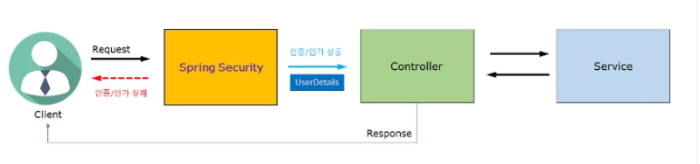
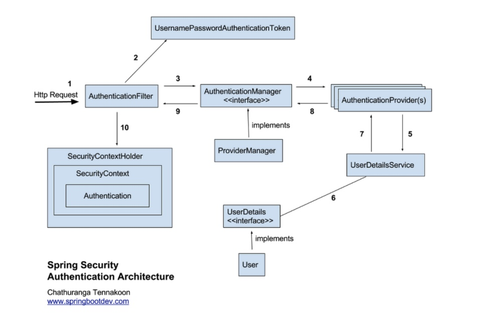

# Week 10 하지명

## 키워드
1. Spring Security
2. 인증(Authentication)과 인가(Authorization)
3. 세션과 토큰
4. 액세스 토큰(Access Token)과 리프레시 토큰(Refresh Token)

## 1. Spring Security
Spring Security란 Spring에서 제공해주는 인증(Authentication)과 인가(Authorization)에 대한 처리를 위임하는 별도의 프레임워크

따라서 일종의 프레임워크에 지나지 않아, 인증-인가를 구현하는 데 있어 필수적인 것은 아님

Spring Security는 '인증'과 '인가'에 대한 부분을 `Filter` 흐름에 따라 처리함</br>
(`Filter`: Dispatcher Servlet으로 가기 전에 적용되므로 가장 먼저 URL 요청을 받음.) 

#### Spring Security 동작 과정



1. 사용자가 로그인 정보(id, password)로 로그인을(인증) 요청
2. AuthenticationFilter가 이의 정보를 인터셉터해 Authentication 객체을 생성해 AuthenticationManager에게 Authentication 객체 전달
3. AuthenticationManager 인터페ㅣ스를 거쳐 AuthenticationProvider에게 Authentication 형태의 정보를 전달하고, 등록된 AuthenticationProvider를 조회해 인증을 요구
4. AuthenticationProvider는 UserDetailsService를 통해 입력받은 사용자의 정보를 DB에서 조회
5. QuthenticationManager는 Authentication객체를 AuthenticationFilter로 전달
6. AuthenticationFilter는 전달받은 Authentication 객체를 LoginSuccessHandler로 전송하고, SecurityContextHolder에 담음
7. 성공 시 AuthenticationSuccessHandle, 실패 시 AuthenticationFailureHandle 실행

## 2. Authentication과 Authorization
### 인증(Authentication)
포털 사이트를 보면 어떠한 작업을 하고자 할 때 '로그인이 필요합니다.' 문구와 함께 로그인 인증이 요구된다면, 이는 인증(Authentication)이 필요한 상황임 </br>
서버 입장에서는 현재 요청자가 회원인지 알 수 없음

### 인가(Authorization)
결국 요청자는 회원가입 및 로그인을 하고 원하는 작업을 하려고 했으나, '권한이 없어 이용할 수 없습니다.'라는 문구가 뜸</br>
이는 인가(Authorization) 즉 접근 권한이 없기 때문에 발생되는 상황

인증(로그인이 되어있는 상태)이 되었어도 인가(로그인은 되어있지만, 권한은 없는 상태)가 없기 때문에, 접근할 수 없는 원리임</br>
서버 입장에서는 요청자가 로그인을 했기 때문에 누구인지 특정을 하고 있으나, 권한이 없어 해당 요청을 차단한 것

### 차이점
- 인증 -> 인가 = 가능
- 인가 -> 인증 = 불가능

|                  |  인증(Authentication)  | 인가(Authorization |
|:----------------:|:--------------------:|:----------------:|
|        기능        |       자격 증명 확인       |     권한 허가/거부     |
|      진행 방식       | 비밀번호, 생체 인식, 일회용 핀/앱 | 보안 권한 설정에 따라 상이  |
|  사용자가 볼 수 있는가?   |          예           |       아니요        |
| 사용자가 직접 변경 가능한가? |       부분적으로 가능       |       불가능        |
|      데이터 전송      |       ID 토큰 사용       |    액세스 토큰 사용     |


## 3. 세션과 토큰
### 세션과 토큰
- 세션: 사용자가 인증에 성공한 상태
- 토큰: 무언가를 이용할 수 있는 권한이나 자격을 나타내는 징표

토큰 기반 인증 방식은 세션 기반 인증이 가지고 있던 한계를 극복하고자 만들어짐</br>
세션 기반 인증은 서버에서 유저의 상태를 관리함.

### 세션 기반 인증방식
1. 유저가 인증정보를 담아 서버에 로그인 요청을 보냄
2. 서버는 데이터베이스에 저장된 유정의 인증정보를 확인함
3. 인증에 성공했다면, 해당 유저에 대한 세션을 생성하고, 이를 서버 메모리에 저장함
4. 쿠키(매개체)를 통해 해당 유저의 세션 id를 클라이언트에 전달함
5. 클라이언트에 세션 id가 저장됨
6. 클라이언트에서 서버로 리소스를 요청할 때, 쿠키(매개체)에 세션id가 함께 전달됨(GET /someinfo)
7. 서버는 전달받은 세션 id를 토대로 유저의 세션 데이터를 조회함
8. 세션이 유효하다면, 유저의 요청에 대한 응답 데이터를 전송함

#### 한계점
서버가 유저의 상태를 관리하여 서버의 부담이 커진다는 것.


### 토큰 기반 인증방식
서버에서 유저의 인증상태를 저장할 필요없이 클라이언트에 이를 저장할 수 있어서 서버의 과부하나 메모리 부족 문제를 줄일 수 있음 </br>
웹 보안에서 토큰은 인증, 권한 정보를 담고 있는 암호화된 문자열임
1. 유저가 인증정보를 담아 서버에 로그인 요청을 보냄
2. 서버는 데이터베이스에 저장된 유저의 인증정보를 확인함
3. 인증에 성공했다면, 서버는 유저에 대한 권한정보를 서버의 비밀키와 함께 토큰을 생성함
4. 서버는 Authorization 헤더에 토큰을 담아 클라이언트에 전달
5. 클라이언트는 전달받은 토큰을 브라우저의 세션 스토리지/로컬 스토리지에 저장
6. 클라이언트가 서버로 리소스를 요청할 때, Authorization 헤더를 통해 토큰이 함께 전달됨
7. 서버는 전달받은 토큰을 서버의 비밀키로 검증. 이를 통해 토큰이 위조되었는지 토큰의 유효기간이 지나지 않았는지 등을 확인할 수 있음
8. 토큰이 유효하다면, 유저의 요청에 대한 응답 데이터를 전송함

#### 장점
서버가 아닌 클라이언트에서 유저의 인증정보를 관리함
1. 무상태성
   - 서버에서 유저의 상태를 관리하지 않음
   - 서버는 토큰의 유효성만 검증
2. 확장성
   - 하나의 토큰으로 다수의 서버에 인증 가능
3. 어디서나 토큰 생성 가능
   - 토큰 생성만을 담당하는 인증용 서버를 만들 수 있음
   - 여러 앱을 하나의 토큰으로 인증하는 등 다양한 활용 가능
4. 권한 부여에 용이
   - 사용자의 인증정보 뿐만 아니라 권한정보도 담아 암호화 가능

|               |                    세션                     |                   토큰                    |
|:-------------:|:-----------------------------------------:|:---------------------------------------:|
| 인증 상태를 저장하는 곳 |                    서버                     |                  클라이언트                  |
|      장점       |             서버에서 인증 상태 관리 가능              |            서버의 무상태성으로 인한 확장성            |
|      한계       | 서버 간 세션 데이터 공유 </br> 혹은 Sticky Session 필요 | 서버에서 인증 상태 관리 불가</br> (e.g. 강제 로그아웃 불가) |


## 4. 액세스 토큰과 리프레시 토큰
로그인 상태를 안전하게 유지하기 위한 인증 방식에서 함께 사용됨.
### 액세스 토큰(Access Token)
#### 역할
- API 요청 시 사용자 인증을 증명하는 토큰
- 이 요청은 로그인한 사용자로부터 왔다는 것을 서버에 증명
#### 특징
- 유효 기간이 짧음 (보통 5분~30분)
- 서버 리소스 접근 권한을 가짐
- 탈취되면 위험 -> 짧게 유지
#### 예
```http request
GET /api/v1/posts
Authorization: Bearer {access_token}
```
#### 서버 동작
1. 토큰 서명 검증
2. 만료 시간 확인
3. 사용자 정보 추출
4. 요청 처리

### 리프레시 토큰(Refresh Token)
#### 역할
- 액세스 토큰이 만료되었을 때, 새 액세스 토큰을 발급받기 위한 토큰
- 직접 API 요청에는 사용하지 않음
#### 특징
- 유효 기간이 김(보통 2주-1개월)
- 서버에 저장(DB/Redis)
- 탈취 시 치명적 -> 더 강력한 관리 필요

#### 사용 예
```http request
POST /auth/refresh
{
  "refreshToken": "xxxx"
}
```