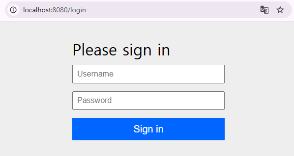
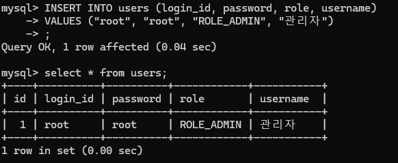
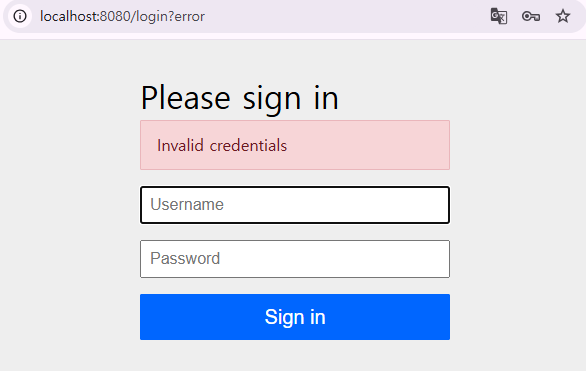
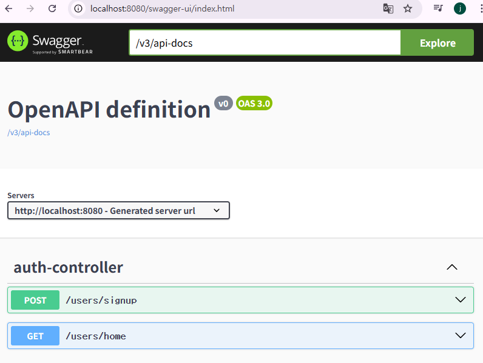
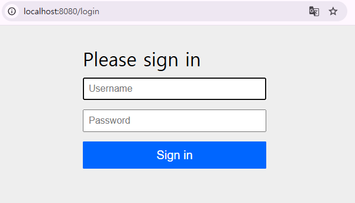
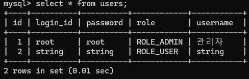
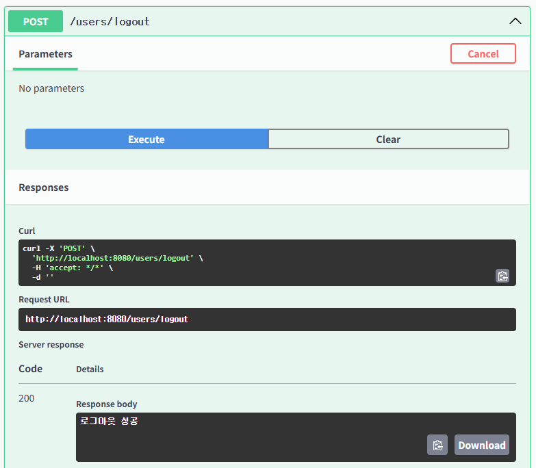
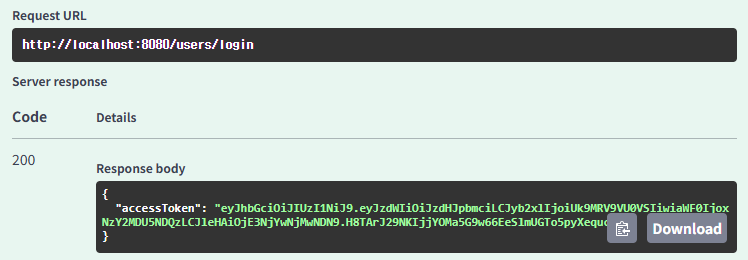

# Week10  Mission

### 깃허브링크

## 1. Spring Security를 활용한 로그인 및 회원가입 구현
### 초기 화면

### 관리자 정보 db에 추가

#### 관리자가 아닌 user가 로그인하려는 경우

- 에러 발생
#### db에 등록되어있는 관리자 계정으로 로그인 한 경우

- swagger가 나옴을 확인할 수 있음

### 기능 구현
#### 1. 회원가입

- DB에 string 유저가 추가된 것을 확인할 수 있음

#### 2. 로그인

#### 3. 로그아웃

- url로 직접 logout을 하면 초기 화면으로 돌아옴

## 2. JWT 방식
### 1. login 성공 시 token 생성 확인

